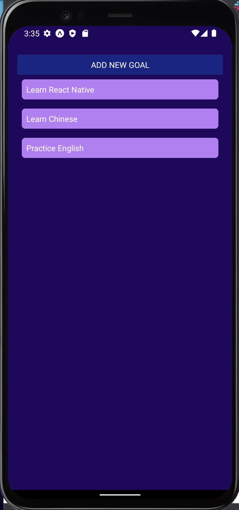
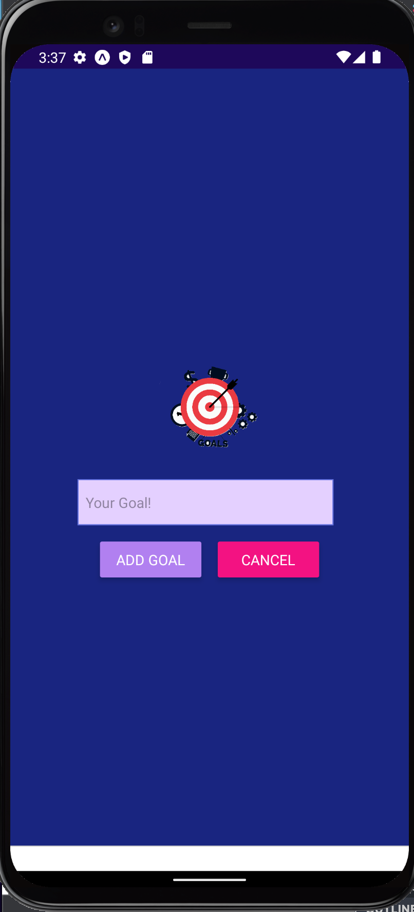

# Super Heroes Capstone React Redux
Goal list is a React Native app for set your list of goals.

## Built With
- React Native
- Expo

### Prerequisites
Node
Android Studio
Xcode

## Getting Started

- Download Expo go app in the app store
- Clone repo `https://github.com/Alexoid1/Goals-list.git`
- cd Goals-list
- npm install
- npm start

## Authors

👤 **Pablo Alexis Zambrano Coral**
- Github: [@Alexoid1](https://github.com/Alexoid1)
- Twitter: [@Alexis Zambrano_acz](https://twitter.com/pablo_acz)
- Linkedin: [linkedin](https://www.linkedin.com/in/alexzambranocoral/)

## 🤝 Contributing

Contributions, issues and feature requests are welcome!

Feel free to check the [issues page](https://github.com/Alexoid1/Goals-list.git).

## 📝 License

This project is [MIT](./LICENSE) licensed.
